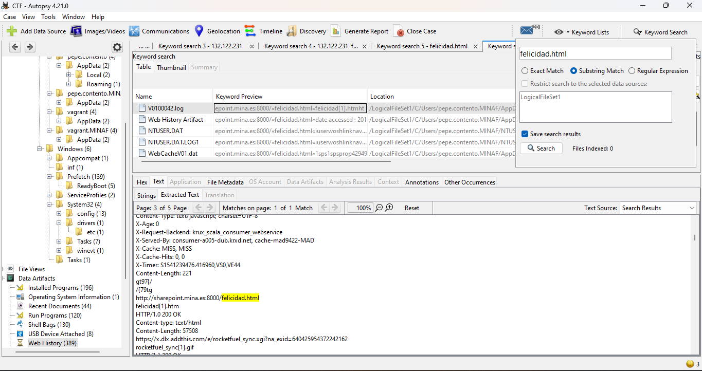

#### challenge statement https://ctf.unizar.es/agujas_pajares/home
#### More challenges: https://ctf.unizar.es/
__Used Tools:__

<a href="https://github.com/keydet89/RegRipper3.0">RegRipper</a>

We need to  need to upload or provide the hive file as input for analysis use RegRipper to analyze it and generate a report file containing the extracted information:

-Hive files extracted from a live system or a forensic image wiches will be analyzed by RegRipper to extract information about system configuration, user activity, installed software, and more.

-Report file is the output generated by running RegRipper on a hive file.

<a href="https://www.autopsy.com/download/">autopsy</a>

keywords in __Autopsy__ refer to specific strings or patterns that are used to identify relevant information within the Windows Registry. These keywords are typically used in the context of plugins, which are small scripts or routines designed to extract specific types of information from Registry hive files.

Each plugin is designed to target specific types of information within the Registry, and keywords are used to help identify relevant data for extraction and analysis.

Keyword lists in __Autopsy__ are curated collections of terms or patterns that plugins use to identify relevant information within Windows Registry hive files.

They play a crucial role in guiding plugins to identify and extract relevant information from Windows Registry hive files, offering both predefined options and customization capabilities to suit the needs of forensic analysis tasks.

  

In __Autopsy__, UTC settings pertain to the configuration parameters stored in the Windows Registry that govern the system's handling of Coordinated Universal Time (UTC). These settings encompass various aspects related to time management on the system, including time zone information, time synchronization mechanisms, and adjustments for daylight saving time.

  
<a href="https://github.com/volatilityfoundation/volatility3">volatility</a> 

__More Tools:__

<a href="https://app.any.run/submissions/">any.run App</a> uses its own virtualization infrastructure to execute and analyze malware samples securely and comprehensively. The platform employs its own set of servers and specialized software to create isolated virtual environments where malware samples can be executed and monitored without compromising the security of users' systems. These virtual environments are designed to emulate operating systems and provide a controlled environment.

<a href="https://www.joesandbox.com/">Joe Sandbox</a> runs on its own cloud infrastructure, using its own servers and systems to perform malware analyses in a virtualized manner. Users don't need to install anything on their own devices; they simply access the platform through a web browser and upload the files they want to analyze. Joe Sandbox's infrastructure takes care of executing these files securely in isolated virtual environments to prevent any potential harm to the user's system.

